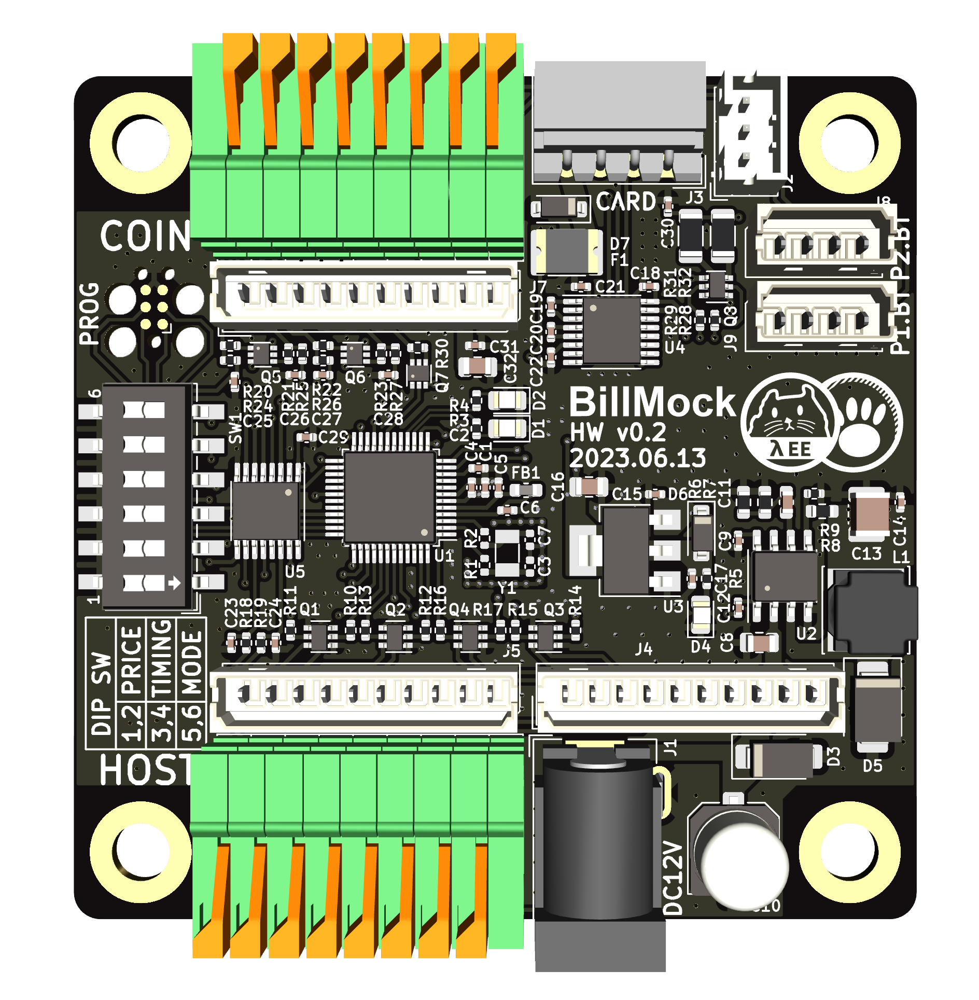
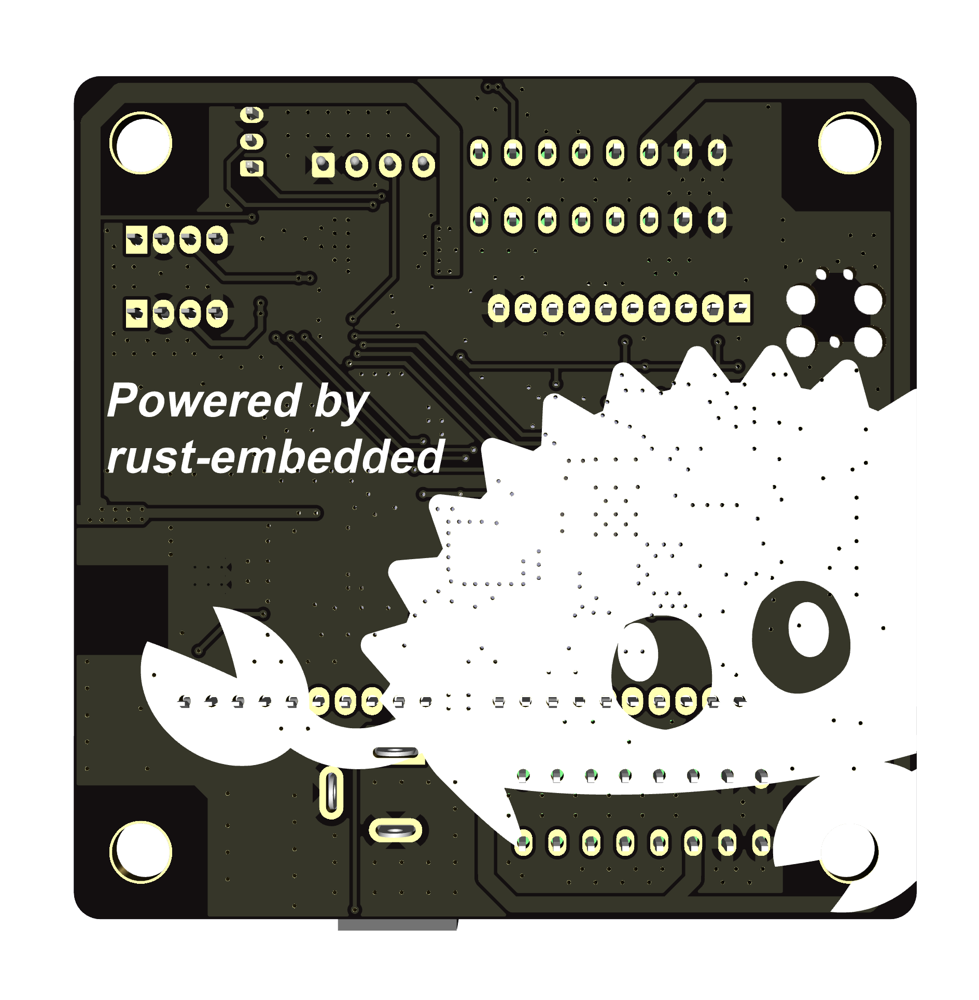
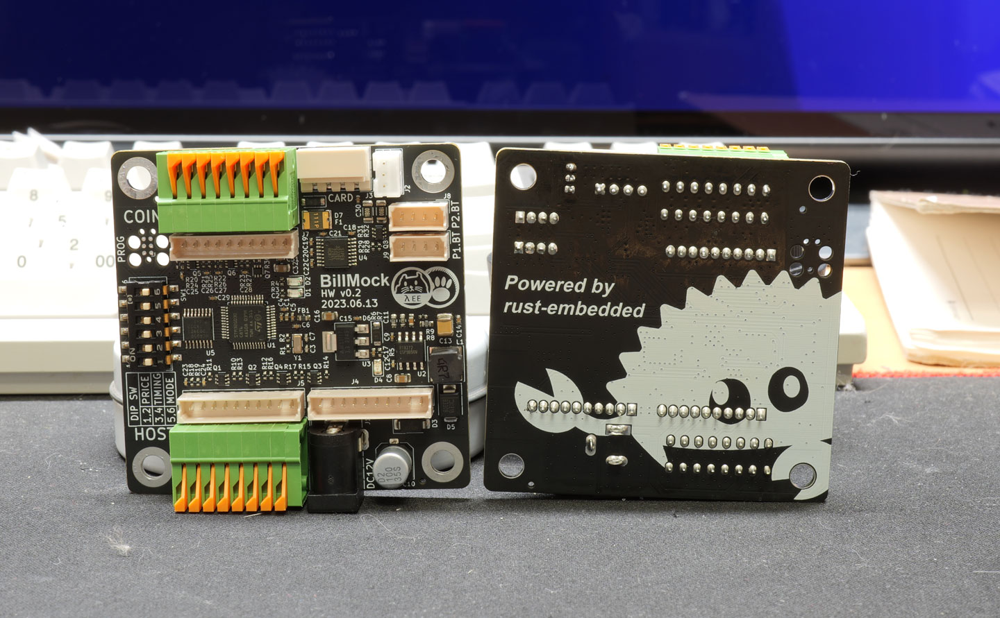

<!--
SPDX-FileCopyrightText: © 2023 Jinwoo Park (pmnxis@gmail.com)

SPDX-License-Identifier: MIT OR Apache-2.0
-->

# `billmock-app-rs`

Rust Embedded firmware using **rust embedded-hal**<sup>[1](#footnote_1)</sup> and **embassy-rs**<sup>[2](#footnote_1)</sup> on **STM32G030C8**<sup>[3](#footnote_1)</sup> MCU for Billmock product.

Used rust experimentally.

This repository is aiming three goal.
One for development of production firmware and second is making a proof of concept that rust embedded is usable for actual embedded production. And last goal is setting some example about production-rust-embedded-code.

**This project is still under the development, not working yet**

## Billmock
It is hardware and software for the purpose of converting I/O signals related to money payment of arcade game machines for compatibility.

This project began development at the request of **GPARK Co., Ltd**<sup>[4](#footnote_1)</sup> and was designed and developed for the using credit card readers in arcade game machine and compatibility of existing payment systems (open-drain-based), and is open to the public except for code in the NDA area.
The project has been granted an open source disclosure except of NDA era.

## Dependencies
See details here [dependencies](doc/dependencies.md)

### NDA Dependencies
To build with NDA features (GPARK Limited or own secret dependency), need adding following command on each `cargo` command.
build, run or any other `cargo` command.

```sh
# dependency injection from git repository
--config 'patch.crates-io.serial-arcade-pay-impl.git = "https://github.com/your_name/your_own_library.git"'

# dependency injection from local repository
--config 'patch.crates-io.serial-arcade-pay-impl.path = "../local_my_repo"'
```

In this repository, experimentally utilize dependency injection that the 'patch' function of 'cargo' to coexist both NDA code and open source example code.

Detail stories [serial-device-limitation](docs/SerialDevice.md)

## Target Hardware
Based on BillMock-HW 0.1 or above.

### Target hardware image
| top side | bottom side |
| ---- | ---- |
|  |  | 



### Hardware design
BillMock hardware schematic repository (only pdf)
https://github.com/pmnxis/BillMock-HW-RELEASE

The schematic printed in PDF is distributed under CC BY-SA 3.0, but the actual Gerber files and project files are private.

#### v 0.2 (2023-06-13)
[BillMock-HW-0v2.pdf](https://github.com/pmnxis/BillMock-HW-RELEASE/blob/master/sch/BillMock-HW-0v2.pdf)

#### v 0.3 (2023-08-11)
[BillMock-HW-0v3.pdf](https://github.com/pmnxis/BillMock-HW-RELEASE/blob/master/sch/BillMock-HW-0v3.pdf)

## License
This program and the accompanying materials are made available under the terms
of the Apache Software License 2.0 which is available at
https://www.apache.org/licenses/LICENSE-2.0, or the MIT license which is 
available at https://opensource.org/licenses/MIT

Also all of codes are based one MIT or Apache Software License 2.0. But some common *.toml files are based on CC0-1.0 license. (Example Cargo.toml)

## Footnote
<a name="footnote_1">1</a> `rust embedded-hal` is hardware abstraction layer written in rust<br>
( https://github.com/rust-embedded/embedded-hal )<br><br>

<a name="footnote_2">2</a> `embassy-rs` is rust embedded framework<br>
( https://github.com/embassy-rs/embassy )<br><br>

<a name="footnote_3">3</a> `STM32G030C8` is STMicroelectronics' MCU with ARM-Cortex M0+ , 64KiB Flash and 8KiB SRAM. <br>
( https://www.st.com/en/microcontrollers-microprocessors/stm32g030c8.html ) <br><br>

<a name="footnote_4">4</a>: `GPARK Co., Ltd.` is a company in South Korea that operates the arcade game industry.
