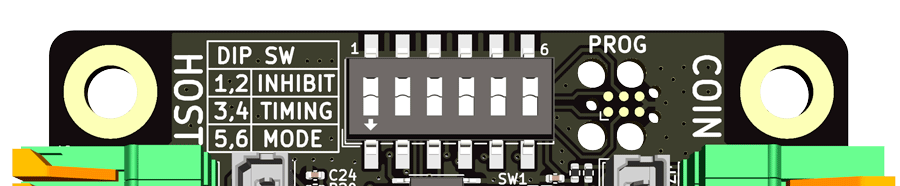

<!--
SPDX-FileCopyrightText: © 2023 Jinwoo Park (pmnxis@gmail.com)

SPDX-License-Identifier: MIT OR Apache-2.0
-->

# DIP Switch

 

## Overview

| **SW #** | **SW Name** | Anotation |
| :-------: | -----------| --------- |
| `1`       | `INHIBIT0` | Inhibit Override - Player 1 |
| `2`       | `INHIBIT1` | Inhibit Override - Player 2 |
| `3`       | `TIMING0`  | Timing Override (50 ms Std) |
| `4`       | `TIMING1`  | Timing Override (100 ms Std) |
| `5`       | `MODE0`    | Application mode |
| `6`       | `MODE1`    | Application mode |

## Inhibit override dip switch configuration

| Inhibit0 (`1`)| Inhibit1P (`2`)| Configuration                   |
| :-----------: | :-----------: | ------------------------------- |
| `0`           |  `0`          | Normal (No force overriding)    |
| `1`           |  `0`          | Override inhibit on 1P as force |
| `0`           |  `1`          | Override inhibit on 2P as force |
| `1`           |  `1`          | Override inhibit globally       |

- By override for each player by dip switch setting, regardless of game I/O signal,
it is forcibly set to inhibit state.
- Even if there is no override in the dip switch settings,
if inhibit is enabled on the host game I/O side, inhibit for each player is activated.
- This Inhibit DIP Switch setting can be used to prohibit currency acquisition
of a device that has under the maintenance in the field engineer.

## Timing configuration

| TIMING0 (`3`) | TIMING1 (`4`) | Configuration                 |
| :-----------: | :-----------: | ----------------------------- |
| `0`           |  `0`          | Auto                          |
| `1`           |  `0`          | Force 50mS active low         |
| `0`           |  `1`          | Force 100mS active low        |
| `1`           |  `1`          | Force 200mS active low        |

- Timing SW `00` (Auto), for the active-low output signal,
 the pulse duration provided by serial communication or
 the pulse duration measurement value of parallel communication (legacy coin & bill acceptor)
 is set separately according to the signal source.
 If both are unavailable, the default value (100 mS) will be used.

- Timing SW `01`, `10`, `11` ignores the pulse duration of all signal sources and
 fixes it to one of 50 mS, 100 mS, and 200 mS and outputs it.

## Application mode dip switch configuration

| MODE0 (`5`) | MODE1 (`6`) | Swap status  | Special Feature                                       |
| :---------: | :---------: | ------------ | ----------------------------------------------------- |
| `0`         |  `0`        | Start Signal | No, Start signal bypass to host(game pcb) side output |
| `1`         |  `0`        | Start Signal | Yes, Start signal decide vend output direction for payment income from serial communication |
| `0`         |  `1`        | Jam Signal   | No, Jam signal bypass to jam(game pcb) side output    |
| `1`         |  `1`        | Jam Signal   | Reserved                                              |

- MODE0 (5) : Special feature disable or enable
- MODE1 (6) : Swap `start` and `jam` input signal on vend side, default definition is start.

- `00` : BypassStart
    > Normal mode with bypass start (default value). Start signal bypass to host(game pcb) side output.

- `01` : StartButtonDecideSerialToVend
    > Special mode with start button mocked.
    > Start signal decide vend output direction for payment income from serial communication.

- `10` : BypassJam
    > Normal mode with bypass JAM (swapped logically). JAM signal bypass to host(game pcb) side output.

- `11` : BypassJamButReserved
    > Bypass JAM (swapped logically). JAM signal bypass to host(game pcb) side output.
    > This configuration is reserved for future usage.
