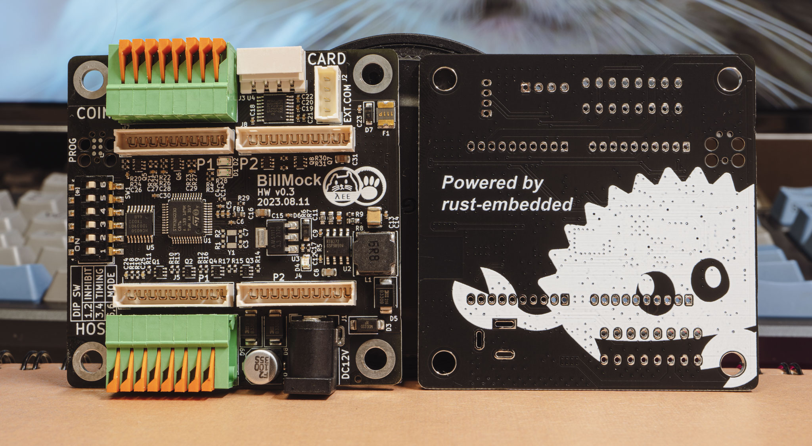

<!--
SPDX-FileCopyrightText: © 2023 Jinwoo Park (pmnxis@gmail.com)

SPDX-License-Identifier: MIT OR Apache-2.0
-->

# Overview

<a style="font-weight:bold" href="https://billmock.gpark.biz">한국어 매뉴얼(Korean Manual)</a>

"Billmock" is a system designed to manipulate the currency payment I/O signals that arcade machines receive based on specific conditions. It is primarily used in South Korean arcade machines for tasks such as installing credit card reader or enabling programmable operations for sequential tasks based on various conditions.
<!--
"Billmock"은 주로 대한민국의 오락실 기계에서 사용되며, 화폐 지불 입력 신호를 특정 조건에 따라 조작하기 위해 개발된 시스템입니다. 이 시스템은 주로 카드 단말기를 설치하거나 신호 대기열에 따른 순차 작업과 같이 다양한 조건에 기반한 프로그래밍 작업이 필요한 경우에 사용됩니다.
-->

To configure it for desired settings on-site, "Billmock" allows preconfigured I/O remapping adjustments through DIP switches. In terms of wiring, it is installed between the HOST GAME PCB and the bill acceptor device.
<!--
현장에서 원하는 설정으로 쓰기위해 미리 설정된 I/O 리매핑을 DIP-Switch로 설정할 수 있으며, wire-map상으로는 HOST GAME PCB 와 지폐기기 사이에 설치가 됩니다. 
-->

## Hardware

There are currently three hardware revisions available: 0.2, 0.3, and 0.4. The development is focused on compatibility with versions 0.3 and 0.4, which are the ones actively in use. Detailed hardware schematics are here
[BillMock-HW-RELEASE](https://github.com/pmnxis/BillMock-HW-RELEASE)
<!--
현재까지 0.2, 0.3, 0.4 총 3가지의 Hardware revision이 있으며 실제로 사용 가능한 것은 0.3, 0.4 에 맞춰서 개발되고 있습니다. 자세한 HW schematic은 
[BillMock-HW-RELEASE](https://github.com/pmnxis/BillMock-HW-RELEASE) 에서 확인이 가능합니다.
-->

## Application
The firmware software has been developed in **Rust**, as opposed to the de facto **C** language. While the choice to use Rust is partly based on trust in its reliability, it also serves the purpose of validating its suitability for embedded systems intended for mass production. Therefore, hope to maintain the firmware source code as a precedent, akin to an example code.

<!--
Firmware software는 defacto로 쓰이던 `C` 언어가 아닌 Rust로 개발되었습니다. Rust를 신뢰해서 쓴 것도 있지만 Rust 로 mass production을 위한 embedded system에 적용이 가능 하다는 것을 검증하기위한 용도 또한 있습니다. 따라서 firmware source가 하나의 example-code 선례로서 남기를 바랍니다.
-->

## License

This program and the accompanying materials are made available under the terms of the Apache Software License 2.0 which is available at [Apache Software License 2.0](https://www.apache.org/licenses/LICENSE-2.0), or the MIT license which is available at [MIT License](https://opensource.org/licenses/MIT)

Also all of codes are based one MIT or Apache Software License 2.0. But some common *.toml files are based on CC0-1.0 license. (Example Cargo.toml)

