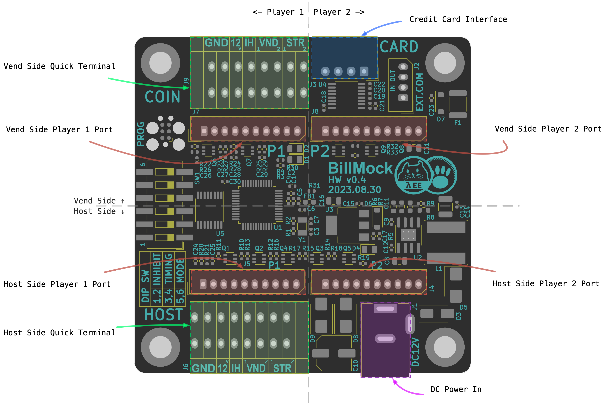

<!--
SPDX-FileCopyrightText: © 2023 Jinwoo Park (pmnxis@gmail.com)

SPDX-License-Identifier: MIT OR Apache-2.0
-->

# Port overview

At the top, there are connectors for the Vend Side, which includes bill paper acceptors, coin acceptors, credit card reader, and similar currency validators.

At the bottom, connectors are placed for the Host Side, which interfaces with the mainboard of the actual arcade machine, such as the GAME I/O PCB.

On the left and right sides, you'll find identical connectors arranged in a decalcomania pattern. The connectors on the left are designated for Player 1, while those on the right are for Player 2.

With this pattern of connectors, it's easy to connect wires to the connectors during actual installation and operation by referring to the layout.

<!--
상단에는 Vend Side(진권에 관련된 지폐기, 동전기, 카드단말기 등) 커넥터가 배치되어 있으며,

하단에는 Host Side(GAME I/O PCB 와 같은 실제 오락기기 메인보드 인터페이스) 커넥터가 배치되어 있습니다.

좌측과 우측에 데칼코마니 패턴으로 같은 커넥터들이 배치되어있으며, 좌측은 Player 1, 우측은 Player 2를 위한 커넥터가 배치되어 있습니다.

이러한 패턴으로 전반적인 커넥터 구성이 되어있으므로, 실제 설치나 운용시에 참고한다면 쉽게 커넥터에 와이어를 연결할 수 있습니다.
-->

From a conceptual perspective, in the existing wiring, the connectors that were originally connected from top to bottom are each separated and connected to the upper and lower connectors. The hardware and software manage the communication between these upper and lower connectors. This design was intentional during the connection setup.

<!--
개념적으로 본다면 기존 배선에서는 위에서 아래로 연결된 커넥터가 각각 끊어지고 위쪽의 커넥터와 아래쪽의 커넥터에 연결되고, 그 사이를 하드웨어와 소프트웨어가 관리하는 형태로 동작하며, 이러한 연결을 설계시에 의도 했습니다.
-->

In addition to these connectors, there are connectors for power supply, an additional RS232 connector for debugging, and an SWD (JTAG) connector for program debugging.
<!--
이 외에도 전원 공급을 위한 커넥터, 디버그용 추가 RS232 커넥터, 프로그램 디버깅용 SWD(JTAG) 커넥터가 있습니다. 
-->
