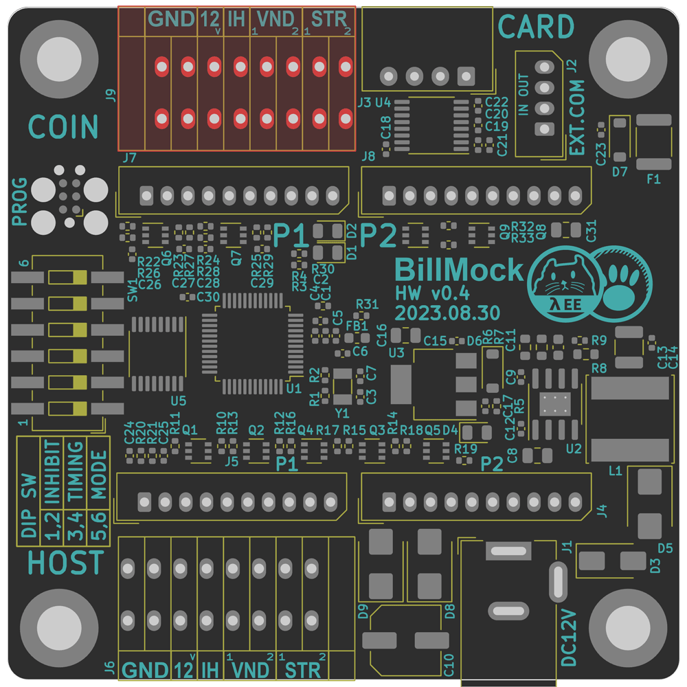
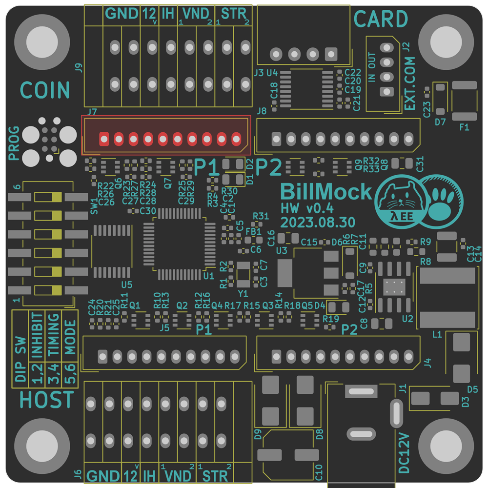
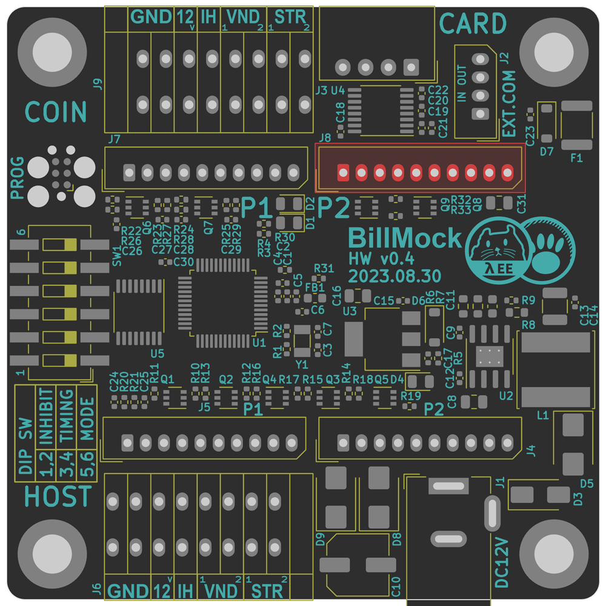

<!--
SPDX-FileCopyrightText: © 2023 Jinwoo Park (pmnxis@gmail.com)

SPDX-License-Identifier: MIT OR Apache-2.0
-->

# Vend side port map

## Vend Side Quick Terminal
<table>
<tr>
<td>

</td>
<td>

|                |                |
| -------------- | -------------- |
| Designator     | J9  |
|                | Existing coin and bill acceptor ports (terminal types)<!--실존하는 코인기 / 지폐기 포트 (터미널 타입)--> |
| Connector      | 141R-2.54-8P |

| **Pin #** | **Pin Name** | Annotation                               |
| :-------: | ------------ | ---------------------------------------- |
| `1`       | `GND`        | Bill acceptor - Pole Power (Input/Output) |
| `2`       | `GND`        | Bill acceptor - Pole Power (Input/Output) |
| `3`       | `12V`        | Bill acceptor + Pole Power (Input/Output) |
| `4`       | `INHIBIT`    | Bill acceptor Inhibit Deactivate Output Signal |
| `5`       | `JAM`        | Bill acceptor 1P Coin Insertion Signal         |
| `6`       | `VEND`       | Bill acceptor 2P Coin Insertion Signal         |
| `7`       | `START1`     | Start Button 1 Input Signal                    |
| `8`       | `START2`     | Start Button 2 Input Signal                    |

<!--
| **Pin #** | **Pin Name**   | Anotation |
| :-------: | -------------- | --------- |
| `1`       | `GND`  |  코인기/지폐기 -극 전원 입력/출력. 제품 -극 전원 |
| `2`       | `GND`  |  코인기/지폐기 -극 전원 입력/출력. 제품 -극 전원 |
| `3`       | `12V`  |  코인기/지폐기 +극 전원 입력/출력, 제품 +극 전원 |
| `4`       | `INHIBIT`  | 코인기/지폐기 입수금지(비활성화) 출력 신호 |
| `5`       | `JAM`  | 코인기/지폐기 1P 진권 입력 신호 |
| `6`       | `VEND` | 코인기/지폐기 2P 진권 입력 신호 |
| `7`       | `START1` | 스타트 버튼 1 입력 신호 |
| `8`       | `START2` | 스타트 버튼 2 입력 신호 |
-->

</td></tr>
</table>

- Pins are counted from the left.
- You can also input power directly into BillMock-HW through `12V` and `GND` pins.
- While it's more convenient to strip tde insulation from tde cable in tde middle and tden connect it to tde terminal,
- It's recommended, whenever possible, to use a cable type that comes pre-equipped for the connection.
- START1/2 can be changed to JAM based on DIP switch settings
<!--
- Pin# 왼쪽 부터 카운트함
- `12V`, `GND`로 BillMock-HW 자체의 전원을 입력받을 수 도 있습니다.
- 터미널 단자는 중간에 케이블을 끊어서 피복을 벋긴다음에 연결할 때에 용이하나,
- 가급적이면 케이블 타입을 구비하여 사용하는 것을 권장합니다.
- START1/2 는 DIP Switch설정에 따라 JAM으로 변경 가능합니다.
-->

------------

## Vend Side Player 1 Port (left)
<table>
<tr>
<td>

</td>
<td>

|                |                |
| -------------- | -------------- |
| Designator     | J7  |
|                | Player 1 side existing  coin and bill acceptor port<!--Player 1 - 실존하는 코인기 / 지폐기 포트 (터미널 타입)--> |
| Connector      | Molex 53014-10xx |
| Housing        | Molex 51004-10xx |
| Crimp          | Molex 50011 |

| **Pin #** | **Pin Name** | Annotation                                     |
| :-------: | ------------ | ---------------------------------------------- |
| `1`       | N/C          | Not Connected                                  |
| `2`       | `VEND`       | Bill acceptor Coin Insertion Signal      |
| `3`       | N/C          | Not Connected                                  |
| `4`       | `START`      | Start Button Input Signal                      |
| `5`       | `INHIBIT`    | Bill acceptor Inhibit (Deactivate) Output Signal |
| `6`       | `GND`        | Bill acceptor - Pole Power (Input/Output) |
| `7`       | N/C          | Not Connected                             |
| `8`       | `12V`        | Bill acceptor + Pole Power (Input/Output) |
| `9`       | `12V`        | Bill acceptor + Pole Power (Input/Output) |
| `10`      | `GND`        | Bill acceptor - Pole Power (Input/Output) |
<!--
| **Pin #** | **Pin Name**   | Anotation |
| :-------: | -------------- | --------- |
| `1`       | N/C    |  |
| `2`       | `VEND` | 코인기/지폐기 진권 입력 신호 |
| `3`       | N/C    |  |
| `4`       | `START`| 스타트 버튼 입력 신호 |
| `5`       | `INHIBIT`| 코인기/지폐기 입수금지(비활성화) 출력 신호 |
| `6`       | `GND`  |  코인기/지폐기 -극 전원 입력/출력. 제품 -극 전원 |
| `7`       | N/C    |  |
| `8`       | `12V`  |  코인기/지폐기 +극 전원 입력/출력, 제품 +극 전원 |
| `9`       | `12V`  |  코인기/지폐기 +극 전원 입력/출력, 제품 +극 전원 |
| `10`      | `GND`  |  코인기/지폐기 -극 전원 입력/출력. 제품 -극 전원 |
-->

</td></tr>
</table>

- Pins are counted from the left.
- START can be changed to JAM based on DIP switch settings

------------

## Vend Side Player 2 Port (right)
<table>
<tr>
<td>

</td>
<td>

|                |                |
| -------------- | -------------- |
| Designator     | J8  |
|                | Player 2 side existing  coin and bill acceptor port<!--Player 2 - 실존하는 코인기 / 지폐기 포트 (터미널 타입)--> |
| Connector      | Molex 53014-10xx |
| Housing        | Molex 51004-10xx |
| Crimp          | Molex 50011 |

| **Pin #** | **Pin Name** | Annotation                                     |
| :-------: | ------------ | ---------------------------------------------- |
| `1`       | N/C          | Not Connected                                  |
| `2`       | `VEND`       | Bill acceptor Coin Insertion Signal      |
| `3`       | N/C          | Not Connected                                  |
| `4`       | `START`      | Start Button Input Signal                      |
| `5`       | `INHIBIT`    | Bill acceptor Inhibit (Deactivate) Output Signal |
| `6`       | `GND`        | Bill acceptor - Pole Power (Input/Output) |
| `7`       | N/C          | Not Connected                             |
| `8`       | `12V`        | Bill acceptor + Pole Power (Input/Output) |
| `9`       | `12V`        | Bill acceptor + Pole Power (Input/Output) |
| `10`      | `GND`        | Bill acceptor - Pole Power (Input/Output) |
<!--
| **Pin #** | **Pin Name**   | Anotation |
| :-------: | -------------- | --------- |
| `1`       | N/C    |  |
| `2`       | `VEND` | 코인기/지폐기 진권 입력 신호 |
| `3`       | N/C    |  |
| `4`       | `START`| 스타트 버튼 입력 신호 |
| `5`       | `INHIBIT`| 코인기/지폐기 입수금지(비활성화) 출력 신호 |
| `6`       | `GND`  |  코인기/지폐기 -극 전원 입력/출력. 제품 -극 전원 |
| `7`       | N/C    |  |
| `8`       | `12V`  |  코인기/지폐기 +극 전원 입력/출력, 제품 +극 전원 |
| `9`       | `12V`  |  코인기/지폐기 +극 전원 입력/출력, 제품 +극 전원 |
| `10`      | `GND`  |  코인기/지폐기 -극 전원 입력/출력. 제품 -극 전원 |
-->

</td></tr>
</table>

- Pins are counted from the left.
- START can be changed to JAM based on DIP switch settings